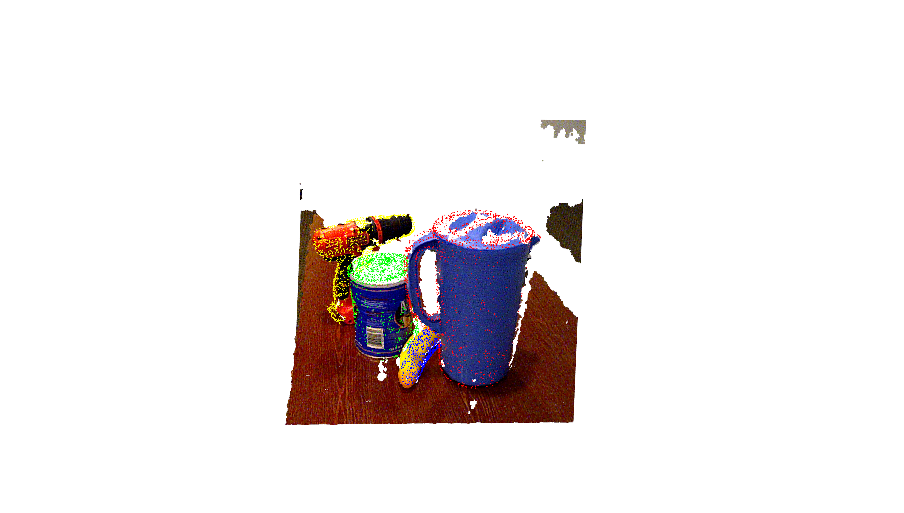

# 6D Pose Estimation with YCB Video Dataset 



## Note

Download [YCB Video Dataset](https://rse-lab.cs.washington.edu/projects/posecnn/) manually.

## Inference

### converted Model
Converted model can be dowloaded [here](https://github.com/knorth55/chainer-dense-fusion/releases/download/v0.0.0/posenet_ycb_converted_2019_02_01.npz).

This model is converted from a model trained with original repository.

### Command

```bash
python demo.py --gpu <gpu> --random
```

## Model conversion

Convert PyTorch model to chainer model.


```bash
python pth2npz.py <pthpath> --out <chainermodelpath>
```
