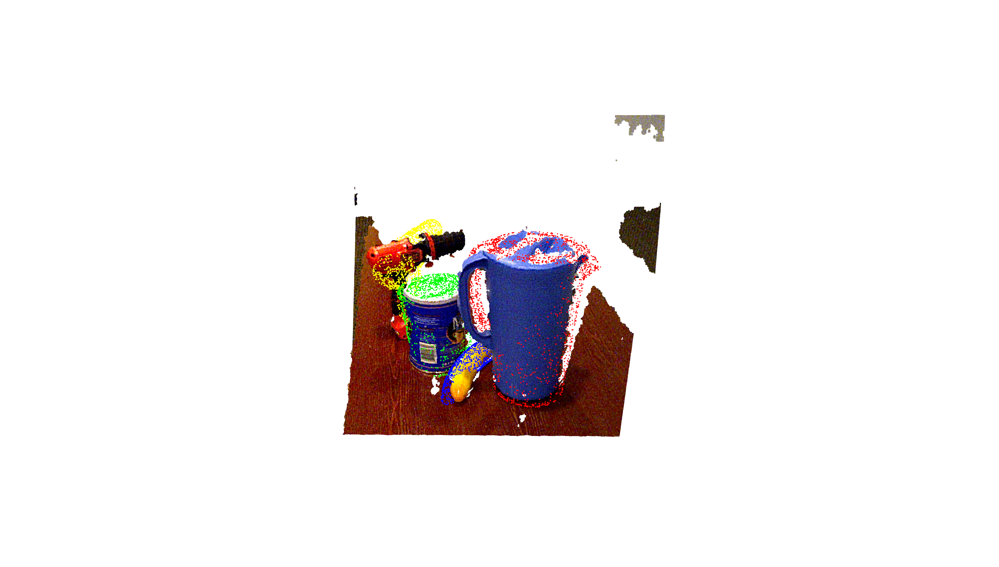

# 6D Pose Estimation with YCB Video Dataset 

## Note

You need to download data below manually.
- Download [YCB Video Dataset](https://drive.google.com/uc?id=1if4VoEXNx9W3XCn0Y7Fp15B4GpcYbyYi) in `~/.chainer/dataset/pfnet/chainer-dense-fusion/ycb`.
- Download [PoseCNN results](https://github.com/yuxng/YCB_Video_toolbox/raw/master/results_PoseCNN_RSS2018.zip) in `~/.chainer/dataset/pfnet/chainer-dense-fusion/YCB_Video_toolbox`

## Inference

### Converted Model
Converted model of Dense Fusion can be dowloaded [here](https://github.com/knorth55/chainer-dense-fusion/releases/download/v0.0.1/dense_fusion_ycb_converted_2019_02_03.npz) and
the one of PoseNet can be dowloaded [here](https://github.com/knorth55/chainer-dense-fusion/releases/download/v0.0.0/posenet_ycb_converted_2019_02_01.npz).

This model is converted from a model trained with original repository.

### Command for Dense Fusion

```bash
python demo.py --gpu <gpu> --random
```


### Command for PoseNet (No iterative refiner)

You can try Dense Fusion with no iterative refiner with command below.

```bash
python demo.py --gpu <gpu> --random --no-refiner
```



## Model conversion

Convert PyTorch model to chainer model.

### Dense Fusion

```bash
python pth2npz.py <posenetpath> <refinerpath> --out <chainermodelpath>
```

### PoseNet (No iterative refiner)

```bash
python pth2npz_posenet.py <posenetpath> --out <chainermodelpath>
```
